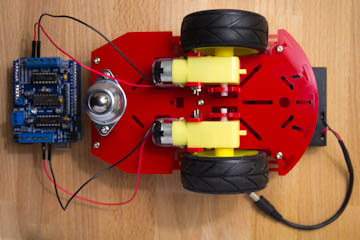
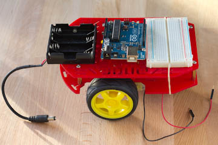

# Arduino Robot Bluethoot

You can control a simple robot with your pc, by bluethoot

## Getting Started

* Clone repository 
* Build [project](link wirediagram)

### Prerequisites

You have device bluetooth for your pc, to dialog between pc and Arduino

## Running

Connect your terminal with arduino and send:
* 1 --> forward
* 2 --> stop
* 3 --> back
* 4 --> right
* 5 --> left

## Built With

* [Arduino](https://www.arduino.cc/) - The main board
* [HC-06](https://it.aliexpress.com/item/Free-Shipping-hc-06-HC-06-RF-Wireless-Bluetooth-Transceiver-Slave-Module-RS232-TTL-to-UART/32501958088.html?spm=a2g0y.search0104.3.1.312dd51d9YayfX&ws_ab_test=searchweb0_0,searchweb201602_4_10152_10151_10065_10068_10344_10342_10343_10340_10341_10084_10083_10304_10615_10307_10302_10059_10184_10314_10534_100031_10604_10103_10142,searchweb201603_32,ppcSwitch_5&algo_expid=68ba93f8-a51d-4009-8730-a471549e6dba-0&algo_pvid=68ba93f8-a51d-4009-8730-a471549e6dba&priceBeautifyAB=4) - use to dialog between arduino and pc
* [L298](https://it.aliexpress.com/item/New-Dual-H-Bridge-DC-Stepper-Motor-Drive-Controller-Board-Module-L298N-for-arduino/32581976321.html?spm=a2g0y.search0104.3.8.20a28babFLwviR&ws_ab_test=searchweb0_0,searchweb201602_4_10152_10151_10065_10068_10344_10342_10343_10340_10341_10084_10083_10304_10615_10307_10302_10059_10184_10314_10534_100031_10604_10103_10142,searchweb201603_32,ppcSwitch_5&algo_expid=e8833564-f10b-4baa-b416-3fcfac0df67b-0&algo_pvid=e8833564-f10b-4baa-b416-3fcfac0df67b&priceBeautifyAB=4) - Driver
* [Robot](https://it.aliexpress.com/item/Free-shipping-Smart-car-chassis-Tracing-car-The-robot-car-chassis-With-code-disc-tachometer-Four/32554236304.html?spm=a2g0y.search0104.3.155.69f74552PByprh&ws_ab_test=searchweb0_0,searchweb201602_4_10152_10151_10065_10068_10344_10342_10343_10340_10341_10084_10083_10304_10615_10307_10302_10059_10184_10314_10534_100031_10604_10103_10142,searchweb201603_32,ppcSwitch_5&algo_expid=55fefe23-5b09-475c-9504-f33765f96550-22&algo_pvid=55fefe23-5b09-475c-9504-f33765f96550&priceBeautifyAB=4)

## Authors

* **Alberto Caliman** - *Initial work*

## License

This project is licensed under the MIT License - see the [LICENSE.md](LICENSE.md) file for details

